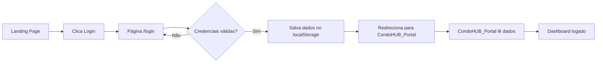

# 🔗 Integração entre Portal RB HUB e CondoHUB_Portal

## 📋 Visão Geral

Este projeto (Portal_RB_Hub) é a **porta de entrada** do sistema RB HUB. Ele contém:
- Landing page institucional
- Catálogo de serviços
- Sistema de orçamentos
- Página de login

O **CondoHUB_Portal** (repositório separado) é a **área logada** onde síndicos e moradores acessam:
- Dashboard personalizado
- Gestão de condomínio
- Comunicados
- Financeiro
- E outras funcionalidades do portal

## 🌐 Domínio e Rotas

### Produção (rbhubsolucoes.com.br)
```
rbhubsolucoes.com.br/              → Portal_RB_Hub (este projeto)
rbhubsolucoes.com.br/portal        → CondoHUB_Portal (área logada)
rbhubsolucoes.com.br/login         → Login (redireciona para /portal)
rbhubsolucoes.com.br/admin         → Painel administrativo CMS
```

### Desenvolvimento Local
```
localhost:5173/                     → Portal_RB_Hub (Vite)
localhost:3000/                     → CondoHUB_Portal (dev server)
```

## ⚙️ Configuração

### 1. Variáveis de Ambiente

Crie/edite o arquivo `.env` na raiz do projeto:

```env
# URL do Portal (CondoHUB_Portal)
VITE_PORTAL_URL=http://localhost:3000

# Para produção, altere para:
# VITE_PORTAL_URL=https://rbhubsolucoes.com.br/portal
```

### 2. Configurando o CondoHUB_Portal

No projeto **CondoHUB_Portal**, você precisará:

1. **Aceitar parâmetros de autenticação via URL**:
   ```javascript
   // Exemplo no CondoHUB_Portal
   const urlParams = new URLSearchParams(window.location.search);
   const userId = urlParams.get('userId');
   const token = urlParams.get('token');
   ```

2. **Ou usar localStorage compartilhado** (mesmo domínio):
   ```javascript
   // Portal_RB_Hub salva após login
   localStorage.setItem('rb-hub-user', JSON.stringify(userData));
   
   // CondoHUB_Portal lê ao carregar
   const userData = JSON.parse(localStorage.getItem('rb-hub-user'));
   ```

### 3. Fluxo de Autenticação



## 🔧 Implementação

### No Portal_RB_Hub (este projeto)

**1. Arquivo de configuração** (`src/shared/config.ts`):
```typescript
export function navigateToPortal(options?: {
  userId?: string;
  token?: string;
  condominiumId?: string;
}) {
  const url = new URL(config.portalUrl);
  
  if (options?.userId) {
    url.searchParams.set('userId', options.userId);
  }
  // ... outros parâmetros
  
  window.location.href = url.toString();
}
```

**2. Após login bem-sucedido** (`src/react-app/pages/Login.tsx`):
```typescript
if (success) {
  navigateToPortal({
    userId: user.id,
    // token: authToken, // quando tiver backend
  });
}
```

### No CondoHUB_Portal

**1. Criar página de entrada** (ex: `portal/index.html` ou `App.tsx`):
```typescript
useEffect(() => {
  // Verificar se há dados de autenticação
  const urlParams = new URLSearchParams(window.location.search);
  const userId = urlParams.get('userId');
  
  // Ou ler do localStorage
  const storedUser = localStorage.getItem('rb-hub-user');
  
  if (userId || storedUser) {
    // Usuário autenticado, carregar dashboard
    loadUserDashboard();
  } else {
    // Redirecionar de volta para login
    window.location.href = '/login';
  }
}, []);
```

## 🚀 Deployment

### Opção 1: Subdomínios
```
www.rbhubsolucoes.com.br     → Portal_RB_Hub
portal.rbhubsolucoes.com.br  → CondoHUB_Portal
```

### Opção 2: Rotas no mesmo domínio (Recomendado)
```
rbhubsolucoes.com.br/        → Portal_RB_Hub
rbhubsolucoes.com.br/portal  → CondoHUB_Portal
```

**Configuração no servidor (Nginx exemplo)**:
```nginx
server {
    server_name rbhubsolucoes.com.br;
    
    # Landing page (Portal_RB_Hub)
    location / {
        root /var/www/portal-rb-hub/dist;
        try_files $uri $uri/ /index.html;
    }
    
    # Portal logado (CondoHUB_Portal)
    location /portal {
        alias /var/www/condohub-portal/dist;
        try_files $uri $uri/ /portal/index.html;
    }
}
```

## 🔐 Segurança

### Tokens JWT (Quando implementar backend)

1. **Login retorna JWT**:
```typescript
const response = await api.post('/login', { email, password });
const { token, user } = response.data;
```

2. **Passar token para o portal**:
```typescript
navigateToPortal({
  userId: user.id,
  token: token
});
```

3. **CondoHUB_Portal valida token**:
```typescript
const token = urlParams.get('token');
const isValid = await validateToken(token);
```

## 📱 Dados Compartilhados

### Via localStorage (mesma origem)
```typescript
// Estrutura dos dados do usuário
interface UserData {
  id: string;
  name: string;
  email: string;
  role: 'master' | 'admin' | 'user';
  condominiumId?: string;
  token?: string;
}

// Salvar
localStorage.setItem('rb-hub-user', JSON.stringify(userData));

// Ler
const userData = JSON.parse(localStorage.getItem('rb-hub-user') || 'null');
```

## 🧪 Testando Localmente

### 1. Portal_RB_Hub
```bash
cd Portal_RB_Hub
yarn install
yarn dev
# Rodando em http://localhost:5173
```

### 2. CondoHUB_Portal
```bash
cd CondoHUB_Portal
npm install  # ou yarn install
npm start    # ou yarn start
# Rodando em http://localhost:3000
```

### 3. Testar integração
1. Acesse http://localhost:5173
2. Clique em "Portal" ou "Login"
3. Faça login com credenciais de teste
4. Deve redirecionar para http://localhost:3000

## 📝 Checklist de Integração

- [ ] Configurar `.env` com VITE_PORTAL_URL correto
- [ ] CondoHUB_Portal aceita parâmetros userId/token via URL
- [ ] CondoHUB_Portal verifica autenticação ao carregar
- [ ] Logout no CondoHUB_Portal limpa dados e redireciona para landing
- [ ] Configurar servidor de produção com rotas corretas
- [ ] Testar fluxo completo em desenvolvimento
- [ ] Testar fluxo completo em produção

## 🆘 Troubleshooting

### Problema: Redirecionamento não funciona
**Solução**: Verificar se VITE_PORTAL_URL está configurado em `.env`

### Problema: Dados do usuário não chegam no portal
**Solução**: 
- Verificar se está usando mesmo domínio (localStorage)
- Ou passar via URL params
- Verificar console do navegador para erros

### Problema: CORS ao fazer requisições entre projetos
**Solução**: Configurar CORS no backend ou usar mesmo domínio

## 📚 Referências

- Documentação do projeto: `/README.md`
- Configurações: `/src/shared/config.ts`
- Sistema de autenticação: `/src/react-app/contexts/AuthContext.tsx`
- Página de login: `/src/react-app/pages/Login.tsx`
